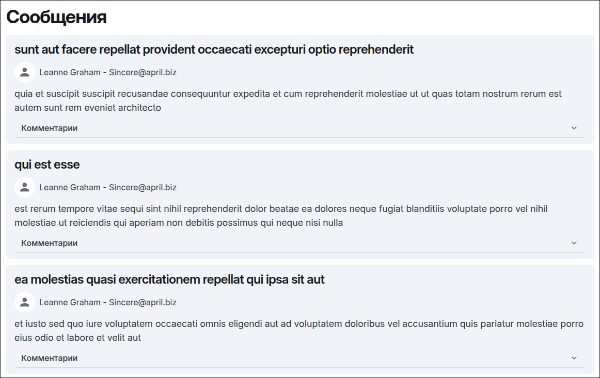
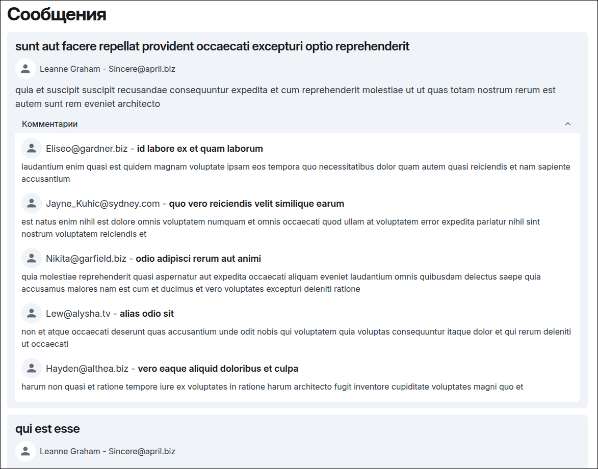

# Тестовое задание

В этом репозитории находится реализация тестового задания для вакансии Web-разработчика в компании ФЛЕТ

### Задание

Есть ресурс, выдающий данные о неких сообщениях <https://jsonplaceholder.typicode.com/posts>

Есть ресурс, выдающий данные о неких пользователях <https://jsonplaceholder.typicode.com/users>

Есть ресурс, выдающий данные о неких комментариях к этим сообщениям <https://jsonplaceholder.typicode.com/comments>

Задача - используя React, написать приложение для просмотра сообщений и комментариев к этим сообщениям.

### Реализация

Задание реализовано на React с использованием следующих библиотек:

- [MUI Joy](https://mui.com/joy-ui/getting-started/) - библиотека UI компонентов
- [Axios](https://axios-http.com/) - отправка запросов
- [Tanstack Query](https://tanstack.com/query/latest) - обработка состояния запроса и временное кеширование данных из ответа

### Скриншоты

